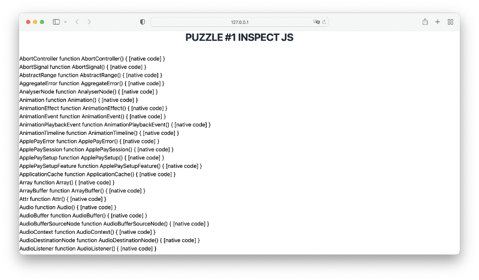

# pyscript puzzle

Some small programms with pyscript (https://pyscript.net)

## #1

In **PyScript** you can use **JavaScript programm objects** with the Python module **js**.

**Task:**

List all JavaScript programm objects with python.

<br><br><br><br><br><br><br><br><br><br><br><br><br><br>

**Solution**

Use Python module **inspect**. It works also with JavaScript.


```python
<html>
    <head>
        <link rel="stylesheet" href="https://pyscript.net/latest/pyscript.css" />
        <script defer src="https://pyscript.net/latest/pyscript.js"></script>
    </head>
    <body>
        <py-title>puzzle #1 Inspect js</py-title>
        <div id="content"><div>

        <py-script>     
import js
import inspect

for i in inspect.getmembers(js):
    PyScript.write('content',f'<p>{i[0]} {i[1]}</p>', append=True)
        </py-script>
    </body>
</html>
```
