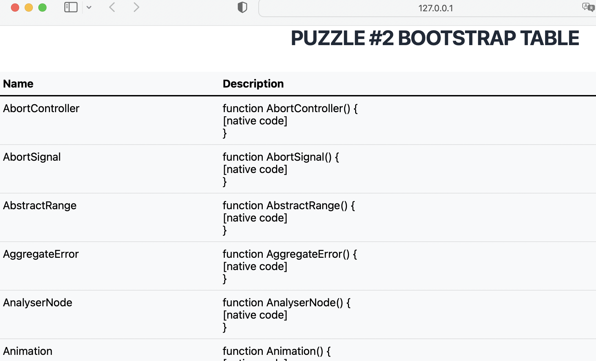

# pyscript puzzle

Some small programs with pyscript (https://pyscript.net)

## #2

Sometimes you need a nice formated **table** in **PyScript**.

**Task:**

Make a table with Bootstrap.js.

<br><br><br><br><br><br><br><br><br><br><br><br><br><br>

**Solution**

You can use **Bootstrap** in Python like you do in JavaScript.


```python
<html>
    <head>
        <link rel="stylesheet" href="https://pyscript.net/latest/pyscript.css" />
        <script defer src="https://pyscript.net/latest/pyscript.js"></script>
        <link href="https://cdn.jsdelivr.net/npm/bootstrap@5.1.3/dist/css/bootstrap.min.css" rel="stylesheet" crossorigin="anonymous">
    </head>
    <body>
        <py-title>puzzle #4 bootstrap table </py-title>
        <table class="table table-light">
            <thead>
                <tr>
                    <th scope="col">Name</th>
                    <th scope="col">description</th>
                </tr>
            </thead>
            <tbody id="content">
            </tbody>
        </table>

    <py-script>
import js
import inspect

table = js.document.getElementById('content')

for i in inspect.getmembers(js):
    row = js.document.createElement('tr')
    object_name = js.document.createElement('td')
    description = js.document.createElement('td')

    object_name.innerText = i[0]
    description.innerText = str(i[1])

    row.append(object_name)
    row.append(description)

    table.appendChild(row)
        </py-script>
    </body>
</html>
```

## #1

In **PyScript** you can use **JavaScript programm objects** with the Python module **js**.

**Task:**

List all JavaScript programm objects with python.

<br><br><br><br><br><br><br><br><br><br><br><br><br><br>

**Solution**

Use Python module **inspect**. It works also with JavaScript.


```python
<html>
    <head>
        <link rel="stylesheet" href="https://pyscript.net/latest/pyscript.css" />
        <script defer src="https://pyscript.net/latest/pyscript.js"></script>
    </head>
    <body>
        <py-title>puzzle #1 Inspect js</py-title>
        <div id="content"><div>

        <py-script>     
import js
import inspect

for i in inspect.getmembers(js):
    PyScript.write('content',f'<p>{i[0]} {i[1]}</p>', append=True)
        </py-script>
    </body>
</html>
```
